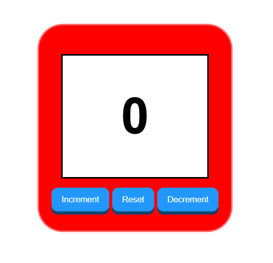

# counter-app

This is my very first project using html, css, and JavaScript.
I create a simple counter program that allows you to increment, decrement, and rest the counter.
I styled it like if it were a little toy as seen below.

